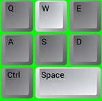
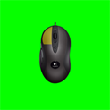

# Show Pressed Keys

Show WASD and mouse overlay to show currently pressed keys. Drawn using GDI+ lib. Intended for use when streaming on Twitch.tv.

This project contains 2 scripts:

- wasd-overlay.ahk - Shows WASD, Ctrl, Space, Q, and E in overlay
- mouse-overlay.ahk - Highlights the pressed key on an image of a mouse (default is a Logitech G400)

&nbsp;&nbsp;

Preview of it in action (bottom right of screen):

## Usage

1. Start `wasd-overlay.ahk` and/or `mouse-overlay.ahk`
2. Move Gui to desired location
3. Select 'Save Position' in Tray Menu
4. In OBS, use Screen Capture and Chromakey on the green background

## Skins

You can create your own mouse skin by creating the necessary files. Take a look at the images in `img/g400` as well as the psd template.

Put all of your new files in a folder ie. `deathadder` and change model in settings.ini to the folder name.

## To Do

*None*